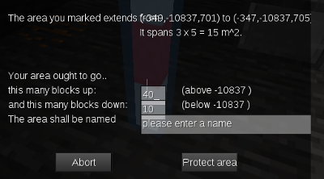
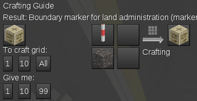
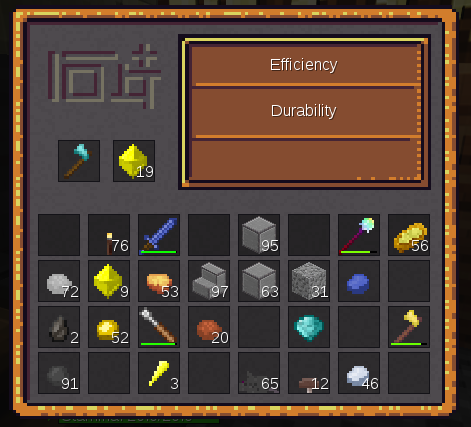
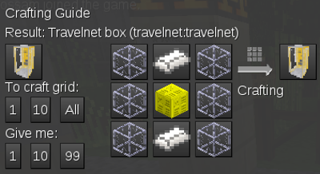

# Les FAQ de Mynetest

Pour jouer à Minetest, il faut surtout bien connaître les différentes icônes en bas de l'inventaire. Celui-ci s'ouvre, par défaut, avec la touche I. En voici une capture d'écran (les numéros sous les icônes serviront dans les explications).

Plus d'explications sur ces icônes sur la page [premiers pas](premiers_pas.html/#les-mystres_de_linventaire "Premiers pas").

Voyez également [le lexique](lexique.html "Lexique") pour avoir l'explication des mots anglais et du jargon du jeu en ligne.

<!--
TODO : certains liens internes ne marchent pas : que faire des lettre accentuées, des apostrophes et des traits d'unions ?

Règles aappliquées par Jekyll pour créer l'id d'un titre :
* tout passer en minuscules;
* ne garder que les signes alphanumériques;
* supprimer les mettre accentuées;
* remplacer toutes les espaces par un tiret;
* supprimer les espaces initiale.
-->

## Sommaire

* [Comment parler aux autres joueurs ?](#comment-parler-aux-autres-joueurs-)
* [Comment téléporter un joueur ?](#comment-tlporter-un-joueur-)
* [Comment protéger ses créations ?](#comment-protger-ses-crations-)
* [Comment ajouter quelqu'un à une area ?](#comment-ajouter-quelqu-un--une-area-)
* [Comment pêcher ?](#comment-pcher-)
* [Comment apprivoiser les animaux ?](#comment-apprivoiser-les-animaux-)
* [Comment protéger les animaux ?](#comment-protger-les-animaux-)
* [Comment réparer les outils ?](#comment-rparer-les-outils-)
* [Comment on fait pousser des plantes ?](#comment-on-fait-pousser-des-plantes-)
* [Comment enchanter un objet ?](#comment-enchanter-un-objet-)
* [Comment vendre des objets ?](#comment-vendre-des-objets-)
* [Comment utiliser le Travelnet ?](#comment-utiliser-le-travelnet-)

* [J'ai un problème : à qui je m'adresse ?](#jai-un-problme---qui-je madresse-)
* [À quelle profondeur trouve-t-on du mithril ?](#quelle-profondeur-trouve-t-on-du-mithril-)
* [À quelle profondeur trouve-t-on du nyan ?](#quelle-profondeur-trouve-t-on-du-nyan-)
* [T'as pas… ?](#tas-pas-)
* [Qui veut être mon ami ?](#qui-veut-etre-mon-ami-)
* [T'as quel âge ?](#tas-quel-ge-)
* [Je peux avoir le "fly" ?](#je-peux-avoir-le-fly-)
* [Je peux être modo ?](#je-peux-tre-modo-)
* [C'est quoi une commande ?](#cest-quoi-une-commande-)
* [Client ? Serveur ? On n'est pas au bistrot !](#client--serveur--on-nest-pas-au-bistrot-)

## Comment parler aux autres joueurs ?

Pour "dire" quelques-chose qui sera lu par tous les joueurs connectés au serveur, tapez la touche T (comme "Talk", le mot anglais pour "parler", puis tapez votre message. Faites un effort pour écrire clairement, et évitez les messages tout en majuscules : c'est interprété comme un comportement agressif. Tout le monde n'est pas une "bête" en orthographe et certains joueurs sont très jeunes, ou d'origine étrangère ce n'est donc pas très gentil de se moquer de leurs fautes.

Si vous voulez envoyez un message privé à une personne qui est connectée (sans que celui-ci ne soit vu par tout le monde), il va falloir utiliser une comande (une commande c'est un message spécial, destiné au serveur, ce qu'on signale en le faisant débuter par le caractère "/", le "slash"). Pour dire "bonjour" à Toto, tapez T puis `/msg Toto Bonjour` (la commande /msg, demande au serveur de transmettre votre message à un joueur et un seul).

Si vous voulez envoyer un message à un joueur qui n'est pas connecté, utilisez la commande /mail qui s'utilise exactement comme /msg : `/mail Toto Bonjour !`

Voici deux petites astuces pour gagner du temps avec ces commandes :
* si vous tapez directement sur / pour commencer un message, le chat s'ouvrira avec le / déjà en place pour une commande, sans que vous n'ayez eu besoin de taper T ;
* si vous tapez les trois ou quatre premières lettres du nom d'un joueur *connecté* puis la touche TAB, le nom du joueur se complètera automatiquement (c'est ce qu'on appelle l'autocomplétion).

## Comment téléporter un joueur ?

<!--
TODO ajouter l'explication pour Multicraft qui nécessite un commande.
Possiblilité d'une présentation particulière pour les info Multicraft ?
 -->

Vous avez la possibilité d'inviter un autre joueur à vous rejoindre en le téléportant vers vous. Pour cela, cliquez sur l'icône n°3 de l'inventaire : une nouvelle fenêtre s'ouvre.

choisissez le nom du joueur dans le menu déroulant de la dernière ligne et cliquez sur *Send To* pour envoyer l'invitation. Si votre invité vient juste de se connecter, il n'apparaît peut-être pas dans la liste. Pour remettre cette liste à jour, cliquez sur *Refresh*.

Quand vous êtes invité par un autre joueur, vous êtes prévenu par un bruit de sonnette. Dans ce cas, retournez à la même fenêtre (troisième icône de l'inventaire) et acceptez l'invitation en cliquant sur *To Player*. Vous êtes bien sûr libre de refuser l'invitation, mais dans ce cas, prenez au moins le temps d'expliquer gentiment pourquoi ("Désolé, je n'ai pas le temps"…)

## Comment protéger ses créations ?

Pour protéger votre maison ou une autre construction, il vous faut créer une *area* qui englobe celle-ci, c'est-à-dire une zone qui vous appartient et où personne d'autre ne peut ajouter ou supprimer des blocs.

Pour créer une area, il faut commencer par crafter (fabriquer) des *Markers* :

Ensuite, vous devez placer deux markers au extrémités d'une des diagonales de la zone à protéger (ne vous occupez pas de la hauteur) :

Faites un clic droit sur un des deux markers, dans la dernière ligne donnez un nom à votre area et validez en cliquant sur *Protect area*. Et voilà ! Votre area est créée. Si vous vous baladez dedans, vous verrez son nom et son ID (son numéro) s'afficher en bas à gauche de votre écran. Vous pouvez récupérer vos markers pour les utiliser plus tard.

**Si vous obtenez un message d'erreur qui vous dit que l'area ne peux pas être créée, c'est sans doute qu'elle est trop grande, ou qu'elle chevauche une area d'un autre joueur. Dans ce cas, rapprochez un peu vos deux markers pour réduire la surface de votre area et essayez à nouveau. N'hésitez pas à poser la question à un modérateur en ligne en lui indiquant le message d'erreur, il saura certainement vous indiquer ce que vous avez mal fait.**

## Comment ajouter quelqu'un à une area ?

Il faut commencer par crafter unn *Boundary Marker* :

Placez le n'importe où *à l'intérieur de votre area* et faites un clic droit dessus. Cliquez su le bouton *Add*, et entrez le nom du joueur dans la petite fenêtre qui s'ouvre ; validez. L'autre joueur peut maintenant agir dans l'area exactement de la même manière que vous (vous pouvez également partager une partie seulement de votre area en créant une nouvelle area à l'intérieur de la première et en ajoutant le joueur a cette deuxième area).

**Si votre area est importante, ajoutez-y seulement des personnes de confiance, autrement c'est une source de chamailleires. Vous pouvez "tester" un joueur en travaillant avec lui sur une area moins "sensible".**

## Comment pêcher ?

Pour pêcher, il vous faudra deux choses : une canne à pêche (*Fishing Pole*) et des appâts :

Comme appâts, vous pourrez aussi utiliser les vers de terre que vous trouverez en labourant vos champs.

Quand vous serez équipé, trouvez un point d'eau suffisamment profond (au moins quatre ou cinq blocs).

Pour que la pêche fonctionne, il faut placer les appâts juste à droite de la canne à pêche dans la première ligne de votre inventaire :

Prenez la canne à pêche en main comme n'importe quel autre outil et faites un clic gauche pour lancer votre ligne. Vous pouvez lancer une deuxième ligne en faisant un autre clic gauche.

À partir de maintenant, vous devez bien surveiller vos deux bouchons. Quand vous avez une touche, vous en verrez un s'enfoncer et vous entendrez un bruit d'éclaboussement : faites vite un clic droit sur le bouchon pour remonter votre prise. Si vous êtes trop lent, le poisson s'échappe ; si vous êtes assez rapide, un message vous indiquera ce que vous avez pris.

## Comment apprivoiser les animaux ?

Vous croiserez différents animaux dans le monde de Minetest. Il est possible de les apprivoiser pour en tirer des œufs, du lait de la laine et beaucoup d'autres choses.

Pour apprivoiser les animaux, le principe est toujours le même : il faut d'abord les nourrir avec leur aliment favori, jusqu'à ce qu'un message s'affiche, par exemple "Rabbit tamed" si vous avez apprivoisé un lapin.

Ensuite il faut attraper l'animal : pour les plus petits (lapins, poules…) il suffit de faire un clic droit dessus *en ayant les mains vides*. Plusieurs clics seront nécessaires, mais attention ! *Si vous faites un clic de trop après avoir capturé l'animal, vous relâcherez celui-ci !*

Pour les gros animaux, il va vous falloir un outil, le *Net* ou le *Magic Lasso* que vous utiliserez aussi avec un clic droit :

La différence entre le *Net* et le *Magic Lasso* est importante: le *Magic Lasso* coûte plus cher, mais la probabilité que l'animal s'en échappe est bien moindre !

Voici un tableau qui vous explique comment capturer les différents animaux :

| Animal       | Nourriture                | Probabilité: Main (%) | Probabilité: Net (%) | Probabilité: Magic Lasso (%) |
|--------------|---------------------------|-----------------------|----------------------|------------------------------|
| Chat         | Rat                       | 50                    | 50                   | 90                           |
| Cheval       | Blé (wheat)               | Non utilisable        | Non utilisable       | 80                           |
| Lapin        | Carotte (carrot)          | 30                    | 50                   | 80                           |
| Manchot      | Poisson cru               | 5                     | 50                   | 80                           |
| Mouton       | Blé (wheat)               | Non utilisable        | 5                    | 60                           |
| Personnages  | Diamant (diamond)         | Non utilisable        | 5                    | 80                           |
| Poule        | Grain de blé (wheat seed) | 30                    | 50                   | 80                           |
| Rat          | Rien                      | 50                    | 90                   | Non utilisable               |
| Sanglier     | Pommes (apple)            | Non utilisable        | 5                    | 50                           |
| Vache        | Blé (wheat)               | Non utilisable        | 5                    | 60                           |

## Comment protéger les animaux ?

Si vous voulez empêcher les autres joueurs de tuer vos animaux, il faut d'abord les garder sur l'une de vos area en les enferment dans un enclos ou dans un bâtiment. *Attention !* les animaux peuvent se faufiler entre deux blocs disposés en diagonale et certains sont capables de sauteer très haut.

Ensuite, vous aurez besoin d'une rune de protection :

Prenez-là en main, et faites un clic droit sur l'animal que vous voulez protéger. La rune disparaît de votre inventaire et un message vous indique que l'opération a réussi : l'animal est protégé *tant qu'il reste sur votre area* ; s'il en sort, les autres joueurs (ou les autres mob) peuvent le tuer.

Vous pouvez aussi donner un nom à vos animaux à l'aide d'un *nametag* :

Prenez-le en main et faite un clic droit sur l'animal. Dans la petite fenêtre qui s'ouvre tapez le nom qui s'affichera au-dessus de lui par la suite. Si l'animal est en bonne santé, le nom sera écrit en vert. Dans le cas contraire il sera en orange ou en rouge. Vous pouvez régénérer les points de vie d'un animal en lui donnant sa nourriture favorite.

## Comment réparer les outils ?

Quand vous utilisez un outil, il s'use petit à petit. Sous son icône, une barre raccourcit et change de couleur pour vous indiquer son état. Quand la barre est rouge et très courte, il est temps de réparer votre outil sous peine de le perdre définitivement.

Pour cela il va vous falloir un établi (*Workbench*) et un marteau (*Hammer*) :

Placez l'établi comme un bloc normal, faites un clic droit et placer l'outil et le marteau comme sur cette image :

Une barre d'usure va apparaître sous le marteau et diminuer progressivement pendant que celle de l'outil se rallonge. C'est un peu long, mais vous aurez bientôt un outil tout neuf. *Note* : cela ne marche que si vous restez à proximité de l'établi, mais vous pouvez fermer la fenêtre et faire autre chose en attendant.

*La case Cut est prévue pour recevoir des blocs que vous pourrez découper en pièces plus fines : planchettes, marches d'escalier…*

## Comment on fait pousser des plantes ?

C'est un peu compliqué et je vous conseille de lire ce qui concerne l'agriculture sur la page [premiers pas](premiers_pas.html/#premiers-pas-de-cultivateur "Premiers pas"). En règle générale vous devez labourer la terre à l'aide d'une houe (*hoe*) et vous assurer que vous êtes au maximum à trois case d'un point d'eau.

Une astuce consiste à créer une étendue d'eau et à installer votre champ dessus, comme un couvercle. Vous pourrez obtenir des étendues illimitées de terre humide.

## Comment enchanter un objet ?

Vous pouvez enchanter certains objets pour les rendre plus efficaces. Les armes et les pioche pourront devenir plus efficaces ou plus durables, les pièces d'armure deviendront plus solides et les bottes enchantées vous permettront de vous déplacer plus vite.

Pour enchanter un objet, il vous faudra des cristaux de mese et une table d'enchantement :

Faites un clic droit sur votre table d'enchantement, placez le mese et l'objet à enchanter comme sur la capture, et choisissez à droite l'enchantement que vous voulez appliquer.

*Vous ne pouvez pas enchanter certains objets, notamment ceux en nyan et en mithril.*

## Comment vendre des objets ?

Depuis peu, le serveur intégre un mod qui permet de créer une sorte de distributeur automatique à l'aide des *Vending Machines*. Pour commencer, il vous faudra un coffre verrouillé (*Locked_Chest*) et une machine (*Vending Machine*) :

Posez le coffre au sol et posez la machine par-dessus (pour poser un objet sur un coffre, sans ouvrir le coffre, maintenez la touche Maj et faites un clic droit) :

En faisant un clic droit sur la machine, vous accédez à sa fenêtre de configuration :

Dans la case *Offered Item*, faites glisser l'objet que vous voules vendre. Vous pouvez vendre par lot en modifiant le chiffre dans la case d'à côté. Le prix est toujours payé en lingots d'or ; la case permet d'entrer le nombre de lingots que coûtera un lot d'objets (dans notre exemple, un "lot" d'un cristal de mese coûte un lingot d'or).

Vous remarquerez enfin un petit point rouge en haut à droite : il indique que votre machine n'est pas prête à fonctionner : elle utilise le coffre placé en dessous d'elle comme un réservoir dans lequel elle va "pomper" les objets à vendre. Mettez des cristaux de mese dans ce coffre et revenez au menu de configuration de la machine : le rond doit maintenant être vert. Quand il n'y a plus de cristaux dans le coffre, la machine s'arrête.

Pour acheter dans une machine qui appartient à quelqu'un d'autre, cliquez sur le bouton *Buy*.

**Les Depositing Machines sont des "machines à acheter". Elles se configurent exactement comme les vending machines, mais votre coffre devra contenir des lingots d'or qui permettront le paiement. Quand elle n'aura plus de lingots, ou quand le coffre sera rempli pas les objets recherchés, la machine ne pourra plus acheter. Pour vendre, cliquez sur Sell**

## Comment utiliser le Travelnet ?

Vous pouvez poser des cabines *Travelnet* où vous le souhaitez pour avoir ensuite la possibilité de vous téléporter de l'une à l'autre. Pour commencer, fabriquez un petit réseau de test avec deux cabines :

Une fois vos cabines en place, il faudra les configurer toutes les deux (clic droit) :

Dans la première ligne, tapez le nom de la cabine (un nom qui rappelle l'endroit ou elle se trouve : "Maison", "Mine", "Magasin"…).

Dans la deuxième ligne, entrez le nom du réseau auquel appartient la cabine. Chaque joueur peut se créer plusieurs réseaux, et une cabine permet de voyager uniquement sur le réseau auquel elle appartient.

**Faites bien attention à l'orthographe en remplissant cette case : la moindre faute crée un nouveau réseau et vos cabines, sur des réseaux, différents ne pourront pas communiquer.**

La troisième ligne sert simplement à taper votre nom.

Pout utiliser votre réseau, faites un clic droit sur une cabine configurée et choisissez votre destination parmi celles qui vous sont proposées. Si vous ne voyez pas votre deuxième cabine sur ce réseau, vous avez peut-être fait une faute de frappe en la configurant : vérifiez !

Pour reconfigurer une cabine, il faut d'abord la détruire, puis la remettre en place. *On ne peut pas détruire une cabine qui n'a pas encore été configurée*

**Quand vous ajoutez une cabine à un réseau, celle-ci n'est pas automatiquement détectée par les autres cabines de ce réseau.** La nouvelle cabine n'apparaîtra donc pas dans la liste des destinations porposées par les autre cabines. Il faut donc mettre à jour ces autres cabines : pour cela, frappez-les en faisant un clic gauche. Comme avec les machines à café, il faut taper sur les travelnets pour les faire marcher :-)

<!--- ************************************* -->

## J'ai un problème : à qui je m'adresse ?

* S'il il s'agit d'un problème dans le jeu, parlez-en aux autres joueurs qui sauront peut-être vous expliquer ce que vous n'avez pas compris.
* Pour signaler un bug, adressez-vous à l'administrateur du serveur, Upsilon.
* Si vous avez un désaccord avec un autre joueur, vous aurez besoin d'un modérateur qui vous aidera à trouver une solution ; la liste des modérateurs est affichée sur un panneau près du spawn.

Si la personne dont vous avez besoin n'est pas en ligne, voyez [ce sujet](#comment-parler-aux-autres-joueurs-).

## À quelle profondeur trouve-t-on du mithril ?

Au fur et à mesure que l'on s'enfonce sous terre, on trouve de nouveaux minerais. Vous trouverez de l'or à partir de -64, du diamant à partir de -128 et du mithtil à partir du niveau - 512. À partir de -1024 vous commencerez à trouver du mese par blocs entiers (l'équivalent de neuf cristaux). Il n'est pas vraiment utile d'aller plus bas : la composition du sous sol ne change plus. On raconte toutefois que deux imbéciles ont creusé un "trou de kikoo" jusqu'à la profondeur maximale : -30912 blocs !

## À quelle profondeur trouve-t-on du nyan ?

Le *Nyan Cat* est bloc humoristique inspiré d'[une vidéo qui a déjà rendu fous des millions d'internautes](https://www.youtube.com/watch?v=wZZ7oFKsKzY "Nyan !"). On peut en trouver dès -32, mais il est extrêmement rare, et on peut jouer à Minetest pendant des mois sans en trouver.

## "T'as pas…" ?

"Si ! J'ai, mais je ne t'en donnerai pas !"

Beaucoup de joueurs débutants essayent de progresser plus vite en demandant des matériaux et des outils aux plus anciens. Ces derniers refusent assez souvent, car de telles demandes répétées sont un peu agaçantes. Et puis si tout vous tombait à point dans le bec, où serait le plaisir du jeu ?

En revanche, les plus vieux joueurs sont toujours ravis de donner un coup de main, ce qui veut dire que c'est vous qui faites et eux qui vous guident, et ils sont toujours généreux en bons conseils. Aide-toi, Minetest t'aidera !

## Qui veut être mon ami ?

Tout le monde ! Le serveur Mynetest essaye d'entretenir une bonne ambiance où chacun pourra trouver sa place, peu importe qui il est dans la vraie vie. Demandez des conseils plutôt que des objets, n'oubliez pas les mots magiques ("s'il- te plaît" et "merci"), restez simples et poli, sachez être patient et n'oubliez pas de garder le sourire.

Souvent, au début, vous vous sentirez peut-être un peu seul, mais si vous faites de bonnes contructions, vous serez vite invité par vos voisins de serveur pour participer à des projets plus vastes.

## "T'as quel âge" ?

C'est une question qui fait sourire, mais les joueurs se la posent régulièrememnt entre eux et les réponses sont assez surprenantes. Sur le serveur de Mynetest, il y a des joueurs de 8 à 50 ans et de tous les pays. L'un habite même en Nouvelle Zélande, le pays où a été tourné le *Seigneur des anneaux* et qui est situé aux antipodes de la France. 20000 km ! On ne peut pas trouver plus éloigné sans quitter la planète !

Il faut donc savoir respecter les uns et les autres, éviter les "sujets qui fâchent" et rester patient. Certains joueurs enseignent à l'unversité et d'autres sont en CE2 ; ce ne serait pas très sympa de se moquer de leur orthographe ou de leurs difficultés de compréhension. Tendez plutôt la main aux nouveaux qui sont parfois un peu timides.

## Je peux avoir le "fly" ?

Sur le serveur, il existe différents prvilèges qui permettent de construire plus facilement des choses plus compliquées et plus impressionnantes. Théoriquement, on peut tout construire sans privilèges, mais c'est quand même plus simple avec. Le "fly" qui permet de voler en fait parti.

Les modérateurs donnent assez facilement ces privilèges aux joueurs qui animent le serveur et qui se lancent dans des projets de construction un peu fous. Vous pouvez bien sûr leur faire remarquer que tel ou tel privilège vous serait utile pour votre projet du moment, mais ne les harcelez pas pour l'obtenir : c'est agaçant, ça ne donne pas envie de dire "oui" et cela peut même vous valoir une sanction !

**Si vous n'avez pas le privilège *fly* vous pouvez tout de même voler grâce au *Broomstick* : tapez K pour l'activer, puis utiliser Espace pour monter et Maj pour descendre. Attention : l'effet ne dure que trente secondes ! Si vous montez trio haut, plus dure sera la chute !**

## Je peux être modo ?

Le statut de modo, comme les privilèges, c'est quelque-chose qui ne se demande pas. Le rôle du modérateur sur un serveur est le même que celui de l'arbitre sur un terrain de sport : permettre aux gens de s'amuser en s'assurant que les règles sont bien respectées. En cas de conflit entre deux joueurs, le modérateur est là pour "calmer le jeu" et pour éviter que les petites chamailleries dégénèrent en véritables fâcheries. Si vous devenez modo vous serez également très solicité par les joueurs qui ont juste besoin d'un petit coup de main ou d'un petit conseil. Bref : à force d'arbitrer, vous aurez beaucoup moins de temps pour jouer (voir plus du tout).

Le modérateur a généralement presque tous les privilèges, et s'il le voulait, il pourrait semer la pagaille partout sur la carte du jeu (en mettant de la lave partout, en remplaçant toute la pierre par de l'air, en rendant le Nyan aussi courant que la cobble… Il parait meme que certain peuvent faire tomber la foudre sur les joueurs !). Mais il ne le fait pas, car comme le disent les linuxiens : "un grand pouvoir implique de grandes responsabilités". Avant de pouvoir modérer les autres, il faut d'abord être capable de se modérer soi-même. Alors ? vous voulez toujours être modo ?

## C'est quoi une commande ?

Une commande, c'est tout simplement un message que l'on envoie à l'ordinateur en tapant du texte au lieu de cliquer sur des boutons avec la souris. Quand on écrit dans le chat, on peu signaler à l'ordinateur que c'est à lui que s'adresse le message en le faisant commencer pas le signe */*. Par exemple, je peux me téléporter chez moi en passant par le menu de mon inventaire, mais je peux aussi taper la commande */home*. C'est un message qui demande à l'ordinateur de me téléporter chez moi.

Minetest est un programme écrit par des volontaires et sur lequel il reste encore du travail à faire. On a parfois besoin des commandes pour faire des choses qui ne sont pas faisables avec la souris, et les "pros" trouvent cette façon de faire plus rapide à utiliser.

## Client ? Serveur ? On n'est pas au bistrot !

La carte de Mynetest, la liste des joueurs et toutes les autres informations sont stockées sur un ordinateur qui fonctionne 24 heures sur 24 (c'est grâce à ça que les plus acharnés peuvent miner toute la nuit…). Cet ordinateur fait "tourner" un programme *serveur* qui envoie toutes ces informations vers votre ordinateur ou votre téléphone, pour lui "dire" où est votre personnage,ce qu'il faut afficher autour de lui, qui est en ligne à ce moment-là et tout un tas d'autres choses.

Pour jouer à Minetest sur votre ordinateur, ou sur votre téléphone, vous faites fonctionner un programme *client* qui va échanger des informations avec le programme *serveur*. Les deux programmes envoient et reçoivent des informations, alors pourquoi "client" et pourquoi "serveur" ? Parce-que pour un seul serveur, il y a beaucoup de clients. Un peu comme dans un bar, en fait !
