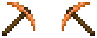

# Lexique des mots anglais

[A](#a)  [B](#b)  [C](#c)  [D](#d)  [E](#e)  [F](#f)  [G](#g)  [H](#h)  [I](#i)  [J](#j)  [K](#k)  [L](#l)  [M](#m)
[N](#n)  [O](#o)  [P](#p)  [Q](#q)  [R](#r)  [S](#s)  [T](#t)  [U](#u)  [V](#v)  [W](#w)  [X](#x)  [Y](#y)  [Z](#z)

<!-- À compléter… -->

## A

*AFK* : Away From Keyboard (éloigné du clavier. "Je vais AFK : il faut que j'ouvre au chien".

*Apple* : pomme.

*Axe* : hache ; plus rapide pour couper le bois.

## B

*Ban (to)* : bannir. Un joueur qui ne respecte pas les règles du serveur peut être "ban" (banni) par les modérateurs. La durée du ban peut varier suivant la gravité de la faute commise.

*Bag* : sac ; utile pour transporter plus de matériel.

*Barley* : orge.

*Beans* : haricots.

*Blueberry* : myrtilles.

*Boots* : bottes.

*Bread* : pain.

*Bug* : erreur de programmation qui produit un comportement inattendu dans un logiciel.

*Build (to)* : construire. Dans le jargon du jeu, un "build" est une construction.

## C

*Cabinet* : placard.

*Chair* : chaise.

*Cheat (to)* : tricher. Bien sûr, c'est interdit, et c'est puni par les modos.

*Chest* : coffre ; locked chest : coffre verrouillé ; shared chest : coffre partagé.

*Chestplate* : plastron (la partie de l'armure qui protège le torse).

*Clay* : argile

*Clippers* : cisailles. Pour tondre les mouton.

*Coal* : charbon.

*Cobble* : galet.

*Copper* : cuivre.

*Crafter* : fabriquer un objet.

## D

*Déco* : déconnecter. "Il faut que je déco : il est tard".

*Dirt* : terre

*Dough* : pâte (à pain).

## E

## F

*Flint* : silex ; permet de fabriquer un briquet.

*Flower* : fleur.

*Furnace* : fourneau.

## G

*Gravel* : gravier.

*Grief* : action de détruire une construction publique ou appartenant à un autre joueur, située sur une area ou non. Saccager le paysage est aussi du grief. Le grief est interdit et puni d'un ban.

*Glass* : verre.

*Gold* : or.

*Grapes* : raisin.

*Grass* : herbe.

## H

*Hammer* : marteau ; utile pour réparer les outils.

*Helmet* : casque, heaume.

*Hoe* : houe, bêche. Sert à labourer la terre.

*Home* : maison, foyer ; l'endroit où vous vous reposez en sortant de la mine.

## I

*Iron* : fer.

*IRL* : abréviation de l'anglais In Real Life (dans la vraie vie). Exemple : "Je vais manger du saucisson." — "Dans le jeu ?" — "Non ! IRL !"

## J

## K

*Kick (to)* : botter les fesses. Action de déconnecter de force un joueur qui se comporte mal sur un serveur. C'est un des privilèges des modérateurs.

*Kikoo* (ou Kikoolol) : un joueur un peu jeuneet un peu bêbête.

## L

*Lamp* : lamp

*Leggings* : jambières (pièces d'armure qui protègent les jambes).

*Light* : lumière.

*Lump* : pépite (gold lump : pépite d'ore).

## M

*Mese* : le mese est un minerai magique qui n'existe pas dans la réalité. Il est utile pour faire des "mese systems" qui son des sortes de circuits électriques.

*Mob* : de l'anglais "foule" ; désigne tous les monstres, animaus et personnages non joueurs qui peupelnt le serveur.

*Modo* : abbréviation de "modérateur". Sur un serveur, les modérateurs sont des arbitres. Ils font respecter les règles et calment les conflits entre les joueurs, pour que tout le monde puisse s'amuser tranquilement.

## N

*Network* : réseau.

*Noob* (ou newby) : un joueur débutant.

*NPC* : Non Player Character (personnage non joueur). Les NPC sont des mobs humain qui sont contrôlés par le serveur.

## O

## P

*Pickaxe* : pioche ; l'outil le plus utile de Minetest !

*Pie* : tarte.

*Pit* : puits (de mine).

*Pumpkin* : citrouille.

*PvP* : Player versus Player. Possibilité pour les joueurs d'un serveur de se battre entre eux. Pour les débutants il vaut mieux laisser ce mode désactivé.

## Q

## R

*Raspberry* : framboises.

*Re !* : salut utiisé par un joueur qui vient de se reconnecter ; "Je re dans une minute.".

*Reco* : se reconnecter. "Je vais à la boulangerie, je reco après."

## S

*Sand* : sable

*Sandstone* : gré (une roche faite de sable aggloméré).

*Screwdriver* : tournevis ; sert à faire pivoter des blocs.

*Seed* : graine.

*Shelf* : étagère.

*Shield* : bouclier.

*Shovel* : pelle ; le meileur outil pour le sable et le gravier.

*Sign* : panneau indicateur.

*Silver* : argent.

*Slab* : dalle.

*Sneak (to)* : se faufiler ; dans Minetest on "sneak" en maintenant la touche Maj enfoncée. Ça permet de ne pas tomber dans les trous et de sauter un peu plus haut.

*Spam* : désigne un message répété de manière trop insistante. L'expression trouve son origine dans [un sketch des célèbres humoristes anglais, les Monty Python](https://www.youtube.com/watch?v=anwy2MPT5RE "Spam ! Spam ! Spam !").

*Spawn* : l'endroit où un joueur apparaît à sa première connexion, ou après sa mort.

*Stair* : escalier.

*Stick* : bâton.

*Stone* : pierre.

*Stuff* : argot anglais signifiant "camelotte", "matos". Désigne l'équipement d'un joueur. "Je suis mort et je ne retrouve plus mon stuff."

*Sword* : épée.

## T

*Tamed* : apprivoisé.

*Tin* : étain.

*Trader* : les traders sont des NPC qui peuvent vous vendre différents objets en échange de lingots d'or (de l'anglais pour "commerçant").

## U

*Usebug* : action d'utiliser un bug du jeu pour obtenir des avantage. Le usebug est une façon de tricher, il est donc interdit.

## V

## W

*Water* : eau.

*Wheat* : blé.

*Wood* : bois.

*Wool* : laine.

*Workbench* : établi ; seryt à réparer les outils et à découper les blocs.

## X

## Y

## Z
