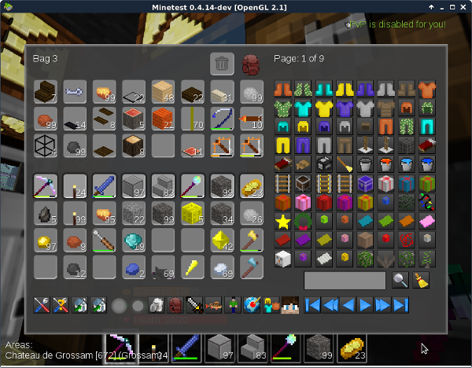
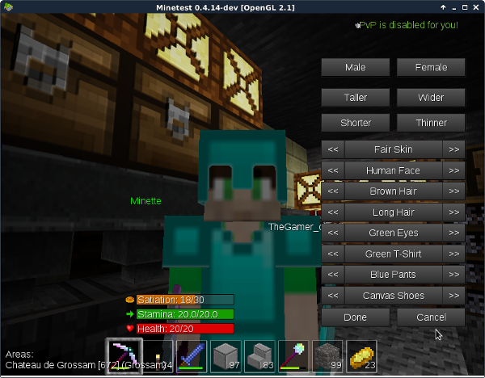

# Premiers pas sur le serveur Mynetest

## Prenez les commandes

Le serveur Mynetest est accessible depuis plusieurs plateformes (PC, téléphone…) et avec différents programmes clients (Minetest, Worldcraft, Multicraft). Les commandes peuvent être un peu différentes dans chaque cas. Commencez donc par lire la rubrique d'aide de votre programme pour apprendre à diriger votre personnage, à casser et à poser un bloc, à sauter, à ouvrir votre inventaire…

Le client Minetest disponible sur les dépôts Linux est configuré pour un clavier anglais (QWERTY) et donc difficile à utiliser sur un clavier français (AZERTY). Heureusement, on peut changer le rôle des touches : à partir du menu d'accueil, cliquez sur l'onglet *Settings*, puis sur le bouton *Change Keys*. Voici un exemple de configuration qui marche bien sur un clavier français :

**Accéder à ce menu est aussi un bon moyen d'apprendre à utiliser les touches sans lire le manuel ;-)**

## Les mystères de l'inventaire

En appuyant sur la touche I, vous ouvrez la fenêtre la plus importante du jeu : l'inventaire. Pour sortir de l'inventaire, vous pouvez appuyer une deuxième fois sur I, ou sur la touche Escape. Regardons-là donc de plus près :

### 1/ L'écran de craft

Il s'agit de votre inventaire lui même et de l'écran de craft. Les neuf cases du haut servent à fabriquer des objets en y faisant glisser des ingrédients selon une disposition bien précise.

Les cases du bas (quatre lignes de dix) représentent les objets que vous portez sur vous. Faites-les glisser pour les disposer comme vous voulez. Seuls les objets de la ligne du haut peuvent être utilisés en jeu.

La case *Trash* représente la poubelle : faires-y glisser les objets dont vous voulez vous débarrasser.

### 2/ Le "Crafting Guide"

Dans Mynetest, on peut fabriquer beaucoup d'objets, et il n'est pas possible de se rappeler toutes les recettes. Cette fenêtre est la pour vous aider. Dans la partie de droite, vous voyez tous les objets craftables dans le jeu. Il y en a plusieurs pages que vous pouvez faire défiler avec les touche 14, celles qui ressemblent aux boutons d'un lecteur DVD.

La petite case suivi d'une loupe sert à rechercher un objet précis. Dans notre exemple, le joueur voulait un casque, il a donc taper "Helmet" avant de cliquer sur la loupe : la fenêtre ne propose plus que les casques. Cliquez sur celui qui vous intéresse, et sa recette s'affiche dans les cases de gauche. Si vous vous rappelez mal le nom d'un objet, vous pouvez juste taper la partie dont vous vous souvenez. Si vous n'êtes pas très à l'aise en anglais, [le lexique](lexique.html "Lexique") est là pour vous aider.

Choisissez ensuite le nombre d'objes que vous voulez fabriquer en cliquant sur les petits boutins sous "To Craft Grid" : un, dix, ou le maximum (All). Vous serez automatiquement renvoyé à l'écran de craft où vous trouverez vos ingrédients tout prêts dans la grille du haut. Vous n'avez plus qu'à faire glisser les objets craftés vers la partie inférieure de votre inventaire.

### 3/ Home, Pit, Spawn

Quand vous aurez trouvé le petit coin de nature idéal pour construire votre maison, c'est sur l'icône trois qu'il faudra cliquer. En utilisant le bouton *Set Home* de la fenêtre qui s'ouvre vous mémoriserez l'endroit comme votre maison et vous pourrez y retourner facilent en cliquant sur *To Home*.

Les boutons *Set Pit* et *To Pit* marchent exactement de la même façon. Ils vous permettent de mémoriser un deuxième endroit qui peut être votre puits de mine, une base secrète, une autre maison… Ce que vous voudrez.

*To Spawn* vous ramène au point où vous êtes apparu à votre première connexion. C'est un endroit que tous les joueurs connaissent, c'est donc un bon point de rendez-vous pour se retrouver et faire des échanges.

Les deux dernières lignes servent à [téléporter les joueurs entre eux](faq_minetest.html#comment-téléporter-un-joueur-).

### 4/ Raccourci vers Home

Ce bouton vous permet de retrouver rapidement votre maison sans passer par le menu précédent. On peut aussi taper la commande */home* dans le chat.

### 5/ Jour ! Nuit ! Jour ! Nuit !

Ces icônes permettent de faire lever et coucher le soleil à volonté. Chez la plupart des joueurs elles sont grisées, car il s'agit d'un privilège réservé aux administrateurs.

### 6/ Vider l'inventaire

**ATTENTION !!! Cette touche vide instantanément tout votre inventaire, sans possibilité de récupérer quoi que ce soit !**

### 7/ Sacs

En plus de votre inventaire, vous pouvez porter jusqu'à quatre sacs. Les sacs sont très utiles, car les grands peuvent contenir jusqu'à quarante objets et vous ne perdez pas leur contenu quand vous mourrez. Prenez donc l'habitude d'y placer régulièrement vos trouvailles les plus précieuses.

Quand vous avez fabriquer un sac, faites-le glisser vers l'un des quatre emplacements du haut, puis cliquez sur le sac pour l'ouvrir et accéder à son contenu. Faites ensuite glisser les objet entre votre inventaire (en bas) et le sac.

Les petits sacs se fabriquent avec du coton, les sacs moyens avec des petits sacs et les grands sacs avec des sacs moyens : il vous faudra beaucoup de coton pour arriver à fabriquer quatre grand sacs.

### 8/ PVP On / PVP Off

En cliquant sur cette icône en forme d'épée vous avez la possibilité d'activer ou de désactiver le PVP, c'est à dire la possibilité d'attaquer les autres joueurs, mais aussi d'être attasué par eux. Il est désactivé par défaut, et il vaut mieux ne pas y toucher quand on débute : un joueur plus expérimenté pourrait vous tuer et vous prendre votre matériel.

### 9/ Concours de pêche

Cliquez sur cette icône en forme de poisson pour voir vos performances lors du dernier concours de pêche auquel vous avez participé.

### 10/ Skin

Cliquez ici pour choisir une nouvelle apparence à votre personnage. C'est un réglage purement esthétique qui ne change rien au jeu.

### 11/ World Edit

Les modérateurs et les administrateurs disposent de puissant pouvoirs qui leur permettent de creuser des lacs ou d'élever des montagnes en quelques clics. C'est ici que ça se passe. Si vous débutez, cette icône est probablement grisée pour vous.

### 12/ Armure

Les case du bas représentent votre inventaire et les cases du haut l'armure que vous portez. Faires glisser les objets des unes aus autres pour vous équiper ou vous déséquiper.

### 13/ Character Creator

Ici vous pourrez personnaliser votre personnage en le renddant plus grans, moins gros, en changeant la couleur de ses yeux… Appuyez d'abord deux fois sur la touche F7 pour vous voir de l'extérieur.

### 14/ Navigation

Nous l'avons déjà vu : ce groupe de boutons permet de naviguer dans la liste des objets craftables.

## "Dis bonjour à la dame !"

## Premiers pas sur terre

## Premiers pas à la ferme

## Premiers pas à la mine

## Quelques commandes utiles

Retrouver dans cette section la plus-part des action decrite plus haut en version plus courte et plus encore, ce qui veux dire:  *Des commandes!*  vous aller gagner du temps !

toute ces commandes sont a écrire dans le chat et commenceront toujours par un slash  */*

*home et pit*
Pour enregistré la position de votre home il suffit de taper dans le chat: */sethome*
Pour le pit c'est la meme chose taper: */setpit*
Faite */home* ou */pit* pour vous y rendre.

Pour teleporter un joueur a vous: */invite_player pseudo*
exemple: pour teleporté toto a vous il faut taper: /invite_player toto
Il ne reste plus qu'a toto a accepter l'invitation.

Accepter une invitation de téléportation: */to_player*
Cette commande vous teleportera a la derniére persone qui vous a invité.

Quelle heure est-il ?  */time*

*Parler une autre langue:*
pour parler a un englais par exemple il vous suffit de taper: */bb EN votre_message*
Le /bb indique que l'on souhaite une traduction, *EN* c'est l'indicatife qui indique que l'on veux une traduction en englais (english).
exemple: /bb EN salut mon amis toto!    affichera dans le chat: [babel]: hi my friends toto!
Il existe different indicatife de traduction

plus fort:
Si le cousin englais de toto, brian ecrit un message en englais dans le chat: "i need your help" vous pouvait le faire traduire:

il faut indiquer ou mod (a refaire a chaque reboot du serveur) que nous voulont une traduction en francais a l'aide de cette commade:
*/bblang FR*
puis taper */babel pseudo* dans notre cas */babel brian* vous affichera "j'ai besoin de ton aide"

pour connaitre les langues disponible: */bbcodes*

*/pulverize* Cette commande suprime se que vous avais dans les mains.

*Les tournois*
Le mod PVPplus permet de faire des tournois PVP, en voici les principals commandes:
pour lancer un tournois
/tournament                   lance un tournois simple
/tournament teleport          lance un tournois en teleportant les joueur qui s'engage a votre possition
/tournament teleport (time)   remplacer time par les delait que vous souhaiter avant le debut du tournoit exemple 120, par defaut c'est 60 secondes.

pour regoindre ou quitter un tournois
/engage
/leave_tournament

*/status* vous affichera les message du serveur avec la liste des joueurs conecté

*/irc_names* vous affichera la liste des persone conecter au canal IRC (Mynetest et ChanServ ne sont pas des persone réel)

*/mapfix*  Permet de corriger les bug de lumiere ou de courant d'eau!

*/last-login pseudo* Vous donne l'heure et la date de la derniére conection d'un joueur

*/me votre_message* sert a indiquer votre humeur ou autre
exemple: /me est trop occuper en se moment affichera: toto est trop occuper.

*/privs* vous affichera les privilege que vous aver sur le serveur ( par defaut vous avez interact,shoot,home,zoom).

*/mods* Affiche la liste des mods instaler sur le serveur
*/help* Affiche les commandes utile
*/help all* Affiche toute les commandes disponible

